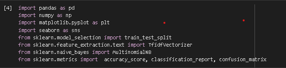
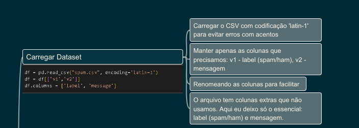
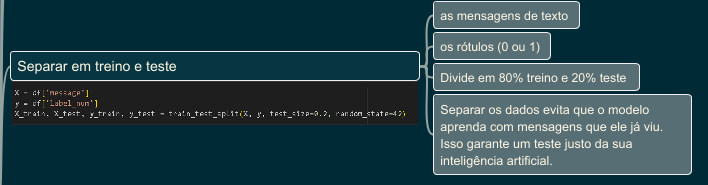
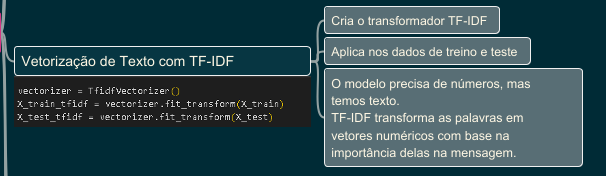
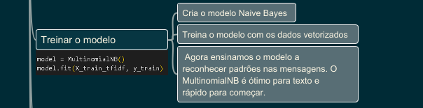
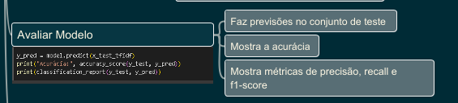

# 📧 Classificador de Spam com Machine Learning

Este projeto utiliza aprendizado de máquina para **classificar mensagens como spam ou não-spam** com base no conteúdo textual.

📂 Tecnologias usadas:
- Python
- Pandas, Numpy
- Scikit-learn (Tfidf, Naive Bayes)
- Matplotlib e Seaborn para visualizações

---

## 📌 Objetivo do Projeto

Desenvolver um classificador de spam simples usando:
- **TF-IDF** para transformar texto em vetores numéricos
- **Multinomial Naive Bayes** como modelo de aprendizado
- **Avaliação com acurácia, matriz de confusão e relatório de classificação**

---

## 🚀 Pipeline do Projeto

Abaixo está o **fluxo completo** do projeto em etapas:

### 1. Importação das bibliotecas

---

### 2. Leitura e pré-processamento do dataset

---

### 3. Separação de treino e teste

---

### 4. Vetorização com TF-IDF

---

### 5. Treinamento do modelo

---

### 6. Avaliação do modelo

---

## 🧠 Mapa Mental

Criei um mapa mental resumindo as bibliotecas utilizadas:

---

## 🔗 Executar no Google Colab

Se quiser testar o projeto, abra o notebook no Colab:

👉 [Abrir no Colab]([https://colab.research.google.com/drive/1y8m1TnQbGDzoyE4fzY7m2WP-irfLz_gd?usp=sharing])

---

## 📬 Contato

Caso tenha interesse em discutir ou melhorar o projeto:

📧 deyvidmail24@gmail.com  
💼 [linkedin.com/in/Deyvid-Martins](https://www.linkedin.com/in/deyvid-martins-545530352/)

---

## ✅ Status

✔️ Projeto funcional e didático  

